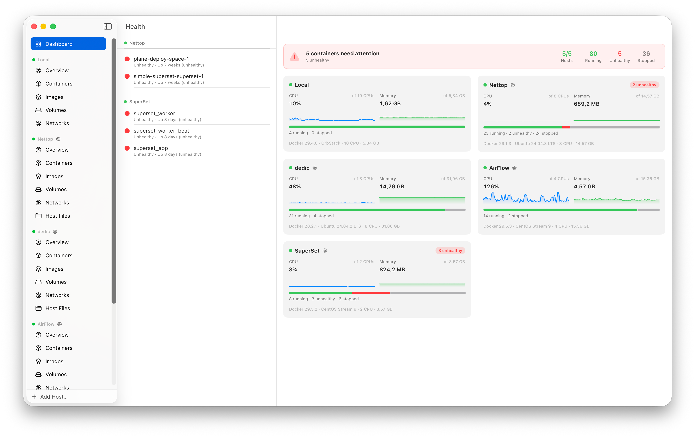
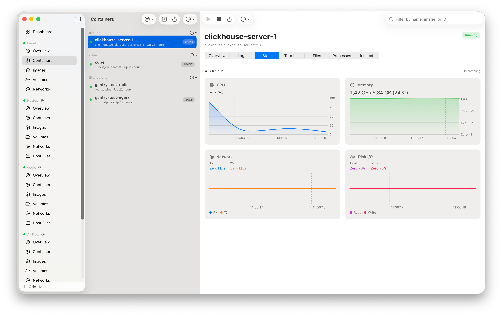
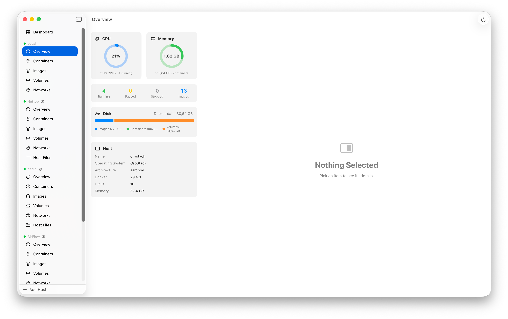

# Gantry

**Native Docker management for your Mac. Local and over SSH. Agent-ready with a built-in MCP server. Free, open source, no limits.**

[](https://github.com/getgantry/gantry/actions/workflows/ci.yml)
[](https://github.com/getgantry/gantry/releases/latest)
[](LICENSE)
[](https://github.com/getgantry/gantry/releases/latest)
[](#agent-friendly)

Gantry is a fully native macOS app (SwiftUI, Swift 6) for managing and monitoring
Docker — the local daemon and any number of remote hosts over SSH — plus
[apple/container](https://github.com/apple/container) hosts on your Mac. No
Electron, no subscription, no artificial limits. It is built to be driven by AI agents
too: a bundled [MCP server](#agent-friendly) and App Intents expose your Docker
hosts to Claude, Shortcuts, Siri and scripts.

Website: **[Gantry — native Docker & apple/container app for Mac](https://getgantry.github.io/)**



## Features

### Core
- **Containers** — list, inspect, start/stop/restart/kill/pause, rename, remove,
  create and run with ports/env/volumes/restart-policy, commit to image,
  export filesystem, view processes (`top`), update restart policy
- **Images** — list, **build from a Dockerfile** (drag-and-drop, live build log),
  history, tag, pull with per-layer progress, remove, prune
- **Private registries** — pulls resolve credentials from your
  `~/.docker/config.json` (inline `auth`, credential helpers, macOS Keychain),
  the same `docker login` you already ran — so create-and-run, Quick Run and
  Compose pull private images, not just the manual Pull sheet
- **Volumes / Networks** — list, inspect, create, remove, prune,
  connect/disconnect containers; volumes show their on-disk size and sort by
  name, size, driver or creation date
- **Docker Compose** — containers grouped by compose project with collapsible
  sections and group start/stop/restart; **run a compose file on any host**
  (local Docker, SSH or apple/container — the runner adapts per engine) with an
  inline **YAML editor**, and open **merged stack logs** for a whole project
- **System** — disk usage (`docker system df`), prune build cache
- **Smart Cleanup** — a *Reclaim Space* panel that shows dangling images,
  stopped containers, unused volumes and build cache with their sizes and prunes
  each, or all at once, reporting how much was freed

### Live
- **Logs** — streamed in real time with follow mode, **regex** or literal
  Cmd+F search with match highlighting and next/previous navigation, a
  **minimum-level filter** (Error/Warn/Info/Debug/Trace), **ANSI color**
  rendering, and a 50k-line virtualized buffer
- **Stats** — CPU, memory, network and disk I/O charts (Swift Charts), 1s sampling
- **Events-driven UI** — lists update live from the Docker events stream,
  with polling fallback

### Notifications
- **Failure alerts** — a native macOS notification the moment a container
  crashes (non-zero exit), runs out of memory, or fails its health check, on
  any host (local, SSH, apple/container). Derived from the live events stream
- **Click through** — opening a notification activates Gantry and jumps
  straight to the offending container's detail view
- **No false alarms** — stops, restarts, kills and removes you trigger from
  Gantry are never reported as crashes, and an unhealthy container alerts once
  per episode, not on every health re-check. Toggle the whole thing in
  Settings ▸ General



### Fleet & hosts
- **Fleet dashboard** — every connected host on one screen: live CPU/memory
  sparklines (10-minute rolling window), container state breakdown, host facts;
  opens at launch
- **Health column** — failed connections and unhealthy / restarting / dead
  containers across all hosts, each row jumping straight to the culprit
- **Host overview** — CPU/memory gauges, Docker disk usage, daemon facts
- **Host terminal & files (SSH hosts)** — a shell on the host itself and an
  SFTP file browser, alongside the per-container ones
- **Auto-reconnect** — dropped tunnels and transient connect failures retry
  with backoff; stale data stays on screen instead of blanking out

### Terminal & Files
- **Exec terminal** — full terminal emulation (SwiftTerm) into any running
  container, local or remote
- **File browser** — browse the container filesystem, download and upload files,
  **drag & drop** between Finder and the container (tar-packed transparently)
- **Drop any folder into a container** — upload whole folder trees from the
  picker or by dropping them from Finder. Works on every engine, including
  apple/container (where there is no archive endpoint, it streams a tar through
  `tar -x` over exec)

### Ports & networking
- **Open in browser** — one click on a published port opens it in your browser:
  directly for local Docker and apple/container, through an automatic forward
  for SSH hosts
- **Local port forwarding (SSH)** — forward a remote container port to
  `localhost` (an `ssh -L`-style tunnel over a dedicated connection). If the
  local port is taken, Gantry picks a free one — and you can edit it. Active
  forwards are listed with open/copy-URL/stop controls
- **Share publicly via Cloudflare Tunnel** — one click on a published port
  exposes it to the internet over [Cloudflare Tunnel](https://developers.cloudflare.com/cloudflare-one/connections/connect-networks/).
  Gantry installs `cloudflared` via Homebrew if it's missing, then starts either
  a **quick tunnel** (no Cloudflare account, an ephemeral `*.trycloudflare.com`
  URL) or a **named tunnel** on your own hostname (after `cloudflared tunnel
  login`). The public URL shows under the port with open/copy/stop. SSH-host
  ports are forwarded locally first, and tunnels are torn down on disconnect —
  great for sharing a dev server or letting an AI agent or webhook reach a
  container running on your Mac

### Remote hosts over SSH
- Connects exactly like `docker -H ssh://user@host`: an SSH exec channel runs
  `docker system dial-stdio` and Gantry speaks HTTP/1.1 to the remote daemon
  over it — nothing to install on the server beyond Docker itself
- Reads `~/.ssh/config` (aliases, HostName, User, Port, IdentityFile,
  **ProxyJump** — bastion chains with per-hop auth and host key checks);
  the Add Host sheet offers one-click import of your config hosts and of
  `ssh://` **Docker contexts** (`docker context ls`)
- ed25519 and RSA keys (openssh-key-v1, optional passphrase), password auth;
  RSA signs with **rsa-sha2-256** so it works against modern OpenSSH servers
- Host key verification with trust-on-first-use prompts (SHA256 fingerprints),
  honoring `~/.ssh/known_hosts`; secrets live in the macOS **Keychain**

### apple/container hosts
- Add an **Apple Container** host to manage Linux containers run by
  [apple/container](https://github.com/apple/container) side by side with your
  Docker hosts
- **Zero-setup onboarding** — on first launch (and after Gantry updates) it
  checks for the `container` CLI and offers to install or upgrade a supported
  version through Homebrew for you, so the runtime is ready before you add a host
- Driven through the `container` CLI and translated to the same engine
  interface, so lifecycle, live logs, exec terminal, stats, create-container,
  images (pull/tag/delete/prune), volumes, networks and disk usage all work
  from the same UI — and through the MCP server and App Intents
- Connecting the host starts the `container` services if they are down
- **Service control** — start/stop the `container` background services from the
  menu bar and Settings ▸ Apple, with live running/stopped status
- **Open by IP & hostname** — every apple/container gets a routable IP on your
  Mac; the container's Overview surfaces that address (and, when it was launched
  on a local domain, its `name.domain` hostname) with one-click open-in-browser
  per port
- **Local DNS domains** — create/list/delete apple/container DNS domains from
  Settings ▸ Apple (admin-approved), and **star a default**: Gantry writes it
  into apple/container's `config.toml` and restarts the services for you, so the
  whole flow works without touching the CLI
- **Automatic DNS names** (OrbStack-style) — new containers are assigned the
  default domain automatically with a unique, image-derived name, so each one
  resolves as `name.domain` across your Mac; the resolver cache is flushed so it
  works immediately. A DNS domain can also be chosen in **New Container** and
  **Quick Run**
- **Assign / Change DNS Name** — set or change a container's domain after
  creation from its Address section. apple/container fixes the domain at create
  time, so Gantry recreates the container, preserving its image, command,
  environment, published ports, volume binds, restart policy and labels (named
  volumes are kept)
- **Quick Run** — an OrbStack-style quick-launch sheet: pick a local image, name
  it, share a macOS folder, map ports and pick a DNS domain, then run — and the
  container's address opens straight in the browser
- **Run docker-compose files from Finder** — right-click a `docker-compose.yml`
  and choose *Open With ▸ Gantry* or *Quick Actions ▸ Compose Up in
  apple/container* (or File ▸ Open Compose File…). Gantry parses the file,
  builds any `build:` services, creates the project's network and named
  volumes, and starts every service in `depends_on` order with the standard
  `com.docker.compose.*` labels — so the project groups in the sidebar just
  like Compose on Docker. apple/container has no native `compose`; Gantry does
  the orchestration itself over the `container` CLI
- **Machines** — list, create, start/stop, delete and set-default the long-lived
  Linux environments `container machine` provides, with an editable CPU/memory
  panel, an interactive shell and a raw inspect view. On apple/container 1.1+ a
  machine can also boot with **nested virtualization** and a **custom kernel**,
  so you can run VMs (or another container runtime) inside one — offered only
  when the Mac supports it, Apple silicon M3 or newer on macOS 15+
- **Unix socket mounts** — bind a socket from your Mac into a container and
  Gantry flags whether the installed CLI propagates its permissions to non-root
  containers (apple/container 1.1+)
- Features the platform does not offer (pause, rename, commit, restart
  policies, network attach, image history, file *download*) are hidden
  for these hosts instead of erroring



### Mac-native
- Three-column split view, Liquid Glass materials, dark/light/system appearance
- Collapsible host sections in the sidebar; reorder hosts via Move Up/Down
- Menu bar panel listing running containers per host — open one in your browser,
  copy its `dns`/`ip:port`, stop/restart inline, or click through to its details
- Keyboard shortcuts (Cmd+R refresh, Cmd+N new container, Cmd+F log search)
- **Terminal themes** (System, Solarized Dark, Dracula, Nord) for the embedded shell
- Optional **Touch ID** confirmation before removing a container or deleting a host
- Auto-updates via **Sparkle** (EdDSA-signed appcast)

### Agent-friendly
- **App Intents** — list/start/stop/restart containers and fetch logs from
  Shortcuts, Siri, Spotlight, or scripts (`shortcuts run`); works even when
  the app is closed
- **MCP server** — a bundled `gantry-mcp` binary exposes the whole app as
  [Model Context Protocol](https://modelcontextprotocol.io) tools over stdio, so
  AI agents can manage your Docker hosts (including SSH ones) with the same reach
  as the GUI:

  ```sh
  claude mcp add gantry -- /Applications/Gantry.app/Contents/Resources/gantry-mcp
  ```

  Tools cover containers (list, lifecycle, **create**, rename, commit, restart
  policy, processes, inspect, logs, stats, exec, **read/write files**, prune),
  images (**pull**, **build**, tag, remove, history, inspect, prune), volumes and
  networks (create, remove, inspect, connect/disconnect, prune), system disk
  usage and build-cache prune, **apple/container machines, services and DNS
  domains**, **Docker Compose up**, and exposing a port publicly via a
  **Cloudflare Tunnel** or an **SSH port forward**. Streaming operations (pull,
  build, compose) run to completion and return their log; tunnels and forwards
  live as long as the server process. Headless SSH connections only use hosts
  whose keys you already trusted in the app.
- **Copy as Prompt** — every container (list, detail view with ⌥⌘P, menu bar,
  dashboard issues) can be copied as a paste-ready debugging prompt for an AI
  coding agent. The prompt carries the host and how to reach it (the exact
  `ssh` command or the local socket), the Gantry MCP `host_id` and tool names,
  the container's identity and state — image, health, exit code, restarts,
  ports, compose project — and a task matched to the symptom: unhealthy asks
  to debug the failing health check, crash-looping to find the crash, healthy
  leaves room for your own question. Paste into Claude Code and let it dig in.

## Install

### Homebrew

```sh
brew install --cask getgantry/tap/gantry
xattr -dr com.apple.quarantine /Applications/Gantry.app
```

The `xattr` step clears the quarantine flag — the app is not notarized and
macOS refuses to open it otherwise.

**Updating:** because the app is ad-hoc signed (not notarized), in-app
Sparkle auto-updates can't launch their installer under Gatekeeper, so updates
go through Homebrew:

```sh
brew upgrade --cask gantry        # or: brew reinstall --cask gantry
xattr -dr com.apple.quarantine /Applications/Gantry.app
```

### Manual

1. Download the latest zip from [Releases](https://github.com/getgantry/gantry/releases/latest)
2. Unzip and drag **Gantry.app** to Applications
3. First launch: right-click the app and choose **Open** (the app is not
   notarized), or clear quarantine:

   ```sh
   xattr -dr com.apple.quarantine /Applications/Gantry.app
   ```

Requires **macOS 26 (Tahoe)** or later. Works with Docker Desktop, OrbStack,
Colima, or a plain remote `dockerd` — the socket is auto-discovered
(`$DOCKER_HOST`, `~/.docker/run`, `~/.orbstack/run`, `~/.colima`, `/var/run`).

Updates arrive automatically via Sparkle once installed.

## Building from source

```sh
git clone https://github.com/getgantry/gantry.git
cd gantry
open Gantry.xcodeproj   # Xcode 26+, build the "Gantry" scheme
```

No setup steps. The project is a thin hand-written `.xcodeproj` whose code
lives in local Swift packages.

### Repository layout

```
App/                  SwiftUI app target (views, intents, app shell)
Packages/
  DockerKit/          Docker Engine API client
    Transport/          unix socket (async-http-client), SSH dial-stdio glue,
                        raw-NIO hijack for exec, hand-rolled HTTP/1.1 codec
    Endpoints/          containers, images, volumes, networks, exec, archive,
                        system, streaming (logs/stats/events)
    Streams/            multiplexed log demuxer, JSON-lines decoder,
                        stats model with the docker CLI CPU/memory formulas,
                        tar reader/writer
  SSHKit/             SSH layer on Citadel: key loading, ssh_config parser,
                      known_hosts + TOFU, SSHDialStdioTransport, local port
                      forwarding (SSHPortForward)
  AppCore/            @Observable stores, hosts persistence, Keychain,
                      headless connections for Intents/MCP
  GantryMCP/          stdio MCP server executable (bundled into the app)
scripts/release.sh    release build + Sparkle appcast
Tools/                app icon generator
```

### How the SSH transport works

`docker -H ssh://` does not forward the remote unix socket. It runs
`docker system dial-stdio` on the server, which bridges the SSH channel's
stdin/stdout to the daemon socket. Gantry does the same with
[Citadel](https://github.com/orlandos-nl/Citadel): one persistent exec channel
carries serialized HTTP/1.1 requests (FIFO, keep-alive), and every streaming
endpoint (logs, stats, events, exec) gets a dedicated channel so nothing blocks.
A `101 Upgraded` response switches the parser into raw passthrough — that is
how the interactive terminal rides the same machinery.

### About the forks

Gantry currently builds against two small forks, both intended for upstreaming:

- [andrewkomkov/swift-nio-ssh](https://github.com/andrewkomkov/swift-nio-ssh)
  (`gantry-fixes`) — fixes a process-killing `preconditionFailure` when a
  pending read delivers a window adjust on a locally closed channel, and lets
  a key type declare a distinct userauth algorithm name
- [andrewkomkov/Citadel](https://github.com/andrewkomkov/Citadel) (`gantry`) —
  RSA signing with rsa-sha2-256 (RFC 8332) instead of legacy ssh-rsa, which
  modern OpenSSH servers reject

### Tests

```sh
swift test --package-path Packages/DockerKit   # parsers, codecs, tar, exec
swift test --package-path Packages/SSHKit      # ssh_config, known_hosts, keys
```

Live integration tests are **gated**: they run automatically only when a local
Docker socket exists (lists, streaming, exec, pull, prune, archive) or when the
SSH test host is reachable (dial-stdio, exec, stream-cancellation stress, RSA
auth). On CI they skip cleanly.

### Releasing

```sh
scripts/release.sh 0.6.0
gh release create v0.6.0 dist/Gantry-0.6.0.zip --title "Gantry 0.6.0"
git add appcast.xml CHANGELOG.md && git commit -m "Release 0.6.0" && git push
```

The script builds the app, embeds `gantry-mcp`, zips, signs the Sparkle appcast
entry (EdDSA key in the login Keychain), and stamps the `## [Unreleased]`
section of [`CHANGELOG.md`](CHANGELOG.md) with the version and date — so the
only manual changelog work is adding bullets under **Unreleased** as you go.

## Known limitations

- Not notarized (no Apple Developer ID) — first launch needs right-click Open
- ECDSA private keys in OpenSSH format are not supported (ed25519/RSA are)
- Remote hosts need `docker` on `PATH` for `dial-stdio` (any recent version)

## License

[MIT](LICENSE)
